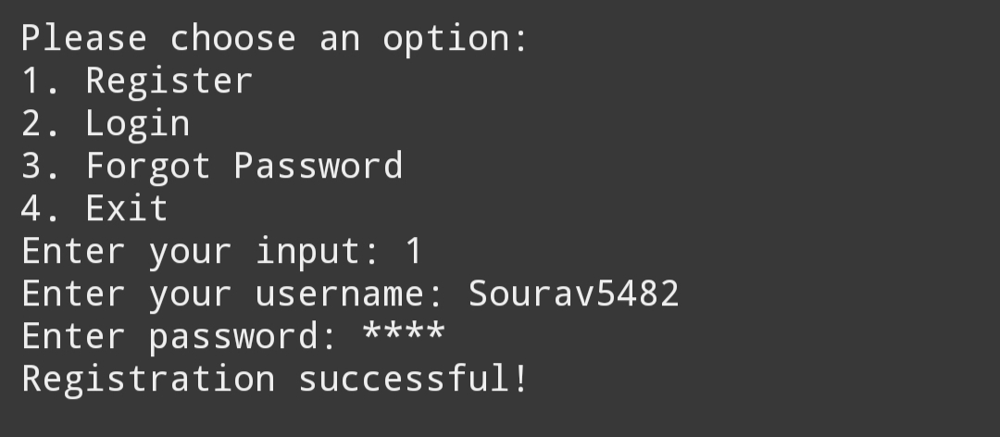
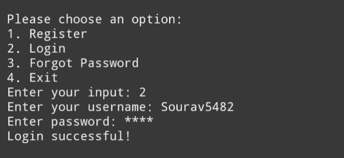
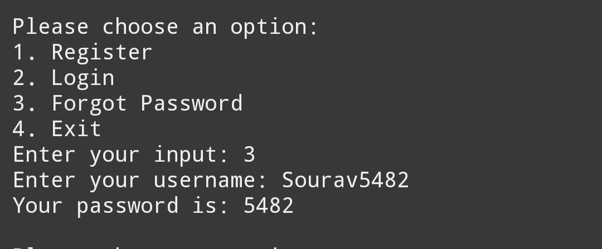
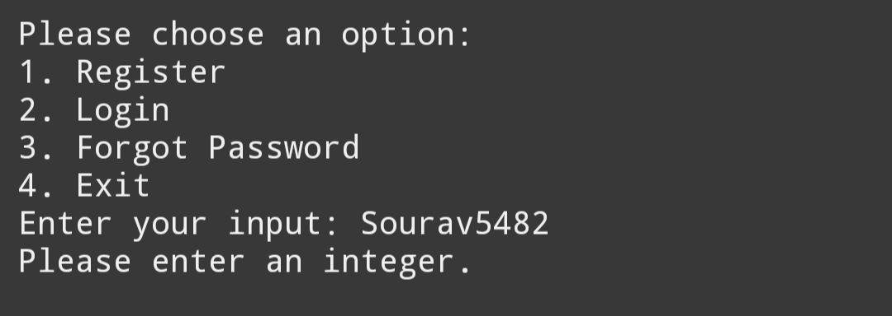
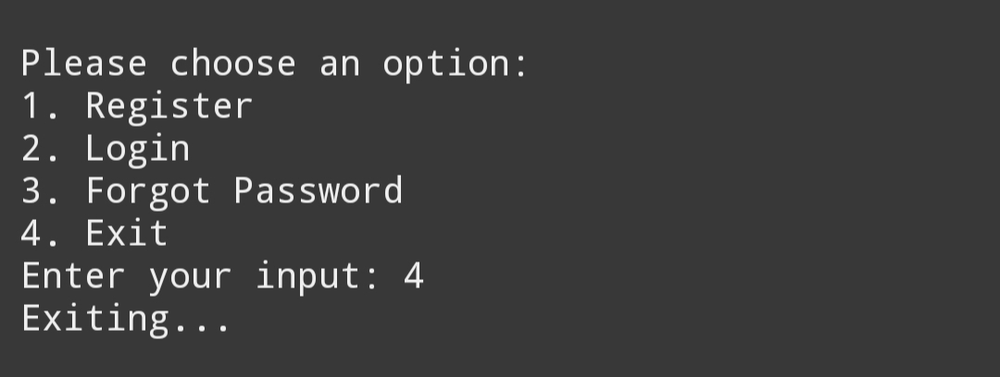
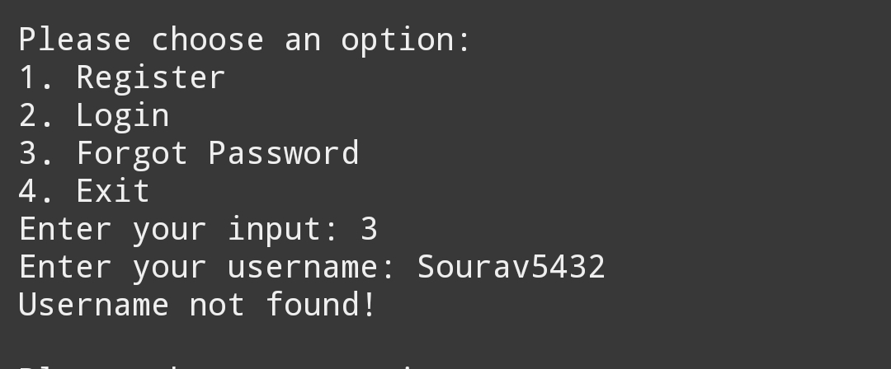

# User Authentication System in C

---
## Demo Screnshots 
> **Registration**


> **Login**


> **Forgot Password**


> **Invalid Input**

> **Exit Option**

> **Username Not Found**

---

## Description

This is a simple **User Authentication System** built using **C programming language**.  
It provides basic features like:

- **User Registration** (Username and Password)
- **User Login**
- **Password Recovery** (Forgot Password option)

The password input hides characters using `*` for better security.

---
## How to Run

1. **Clone** this repository or download the source code.
2. Open a terminal and compile the code:
   ```bash
   gcc auth_system.c -o authApp
   ```
3.Run the executable:
```bash
./authApp
```
## Features

Masked password input with *

Support for backspace during password typing

Username-password matching

Integer-only validation for menu selection

Supports up to 100 users


---
## Future Enhancements

Saving user data permanently using files

Password encryption

Password change feature

User deletion feature


---

## Limitations

All user data is stored in memory only.

Once the program exits, all registered users are lost (no file storage).

---
## 🙌 Author

- **Sourav Das**
- 📧 Portfolio: [sourav5482.github.io](https://sourav5482.github.io/Portfolio/)

---

## 📜 License

This project is licensed under the MIT License - feel free to use and modify it.
